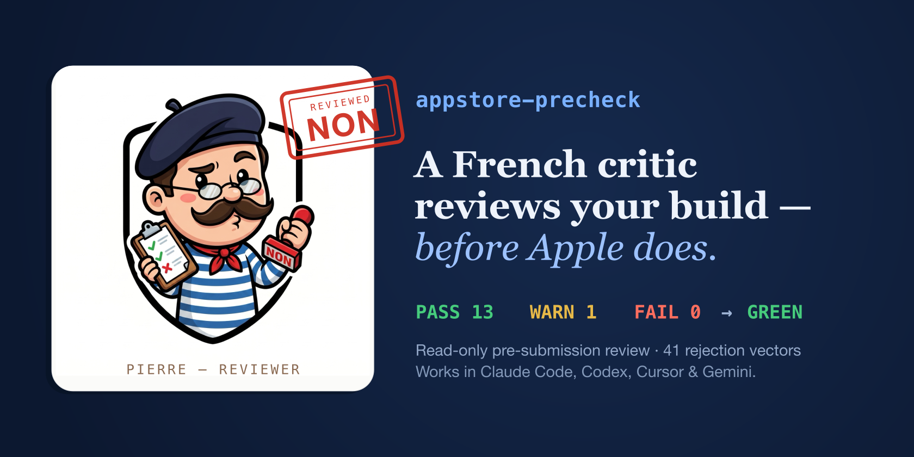

<p align="center">
  
</p>

<p align="center">
  <a href="https://github.com/berkayturk/appstore-precheck/actions/workflows/ci.yml"></a>
  <a href="LICENSE"></a>
  
  
  
</p>

<p align="center"><strong>Catch App Store rejections before a reviewer does.</strong></p>

---

`appstore-precheck` is a read-only, pre-submission gate for iOS apps. It statically scans the most
common rejection vectors, runs Apple's own metadata linter, watches the App Store Review Guidelines
for drift, has Pierre explain every FAIL and WARN, then runs **28 semantic deep-review checks**
(22 high-confidence Tier A + 6 heuristic Tier B v1 — beta language, review notes quality, app preview,
incentivized review, push/HomeKit abuse, rating manipulation).
It hands you a single **GREEN / YELLOW / RED** verdict. It never edits your code.

It ships as a portable [Agent Skill](https://agentskills.io): the same `SKILL.md` runs natively in
Claude Code, OpenAI Codex, Cursor, and Gemini CLI. The scanner is plain Bash, so you can also run it
by hand or wire it into CI.

## Meet Pierre


Your verdict is delivered by **Pierre**, a French critic who has seen ten thousand rejections and is
impressed by none of them. He reviews your build harder than Apple would, in private — first with a
fast static scan, then with **28 deep semantic checks** (22 confident + 6 heuristic). A GREEN from
Pierre means Apple will wave you through.

- 🔴 **RED**: *"Non. Restore Purchases, absent. Guideline 3.1.2. Suivant."*
- 🟡 **YELLOW**: *"A few small uglinesses. I would not reject. But I noticed."*
- 🟢 **GREEN**: *"Hmf. I find nothing. Acceptable. Do not make me regret this."*

The verdict line is in Pierre's voice — **three separate language blocks** (bold label + blockquote
each, divided by horizontal rules), not one compressed sentence. The breakdown beneath it, every
`file:line` and fix, stays plain and surgical.

## What it checks

42 rejection vectors across code, fastlane metadata, screenshots, `PrivacyInfo.xcprivacy`, and the paywall:

| Guideline | Check |
|-----------|-------|
| **1.2** | User-generated content without a report / block / moderation mechanism |
| **1.6** | App Transport Security disabled app-wide (`NSAllowsArbitraryLoads`) |
| **2.1** | No placeholder / dummy copy (lorem ipsum, TODO, `example.com`) in store metadata |
| **2.1** | A login-gated app ships demo credentials / review notes for App Review |
| **2.3** | A working support URL and a privacy URL in fastlane metadata (no placeholders) — also satisfies 1.5 and 5.1.1(i) |
| **2.3.1** | Metadata length limits (name, subtitle, keywords, promo, description) |
| **2.3.1** | Misleading marketing claims (iOS virus / malware scanners, fake speed boosters) in metadata |
| **2.3.3** | At least one screenshot per locale |
| **2.3.3** | Screenshot format + PNG dimensions match a known App Store screenshot size *(advisory, WARN-only)* |
| **2.3.7** | Localized metadata parity across every locale |
| **2.3.8** | "For Kids" / "For Children" wording outside the Kids Category |
| **2.3.10** | No other-platform / competitor names in metadata |
| **2.5.1** | No private / banned APIs |
| **2.5.2** | No executable-code download / native hot-patching (JSPatch, Rollout, …) |
| **2.5.4** | Background modes declared in `UIBackgroundModes` but never used |
| **3.1.1** | Third-party payment SDK (Stripe, Braintree, PayPal, …) linked for digital goods instead of in-app purchase |
| **3.1.1(a)** | External purchase link entitlement + disclosure, when external purchase APIs are used |
| **3.1.2** | Trial & auto-renew subscription disclosures |
| **3.1.2** | Restore Purchases + Terms (EULA) + Privacy Policy on the paywall |
| **3.1.5(a)** | Cryptocurrency wallet / exchange / mining signal |
| **4.2** | Minimum functionality (real navigation) |
| **4.2.3** | Thin WKWebView wrapper around a website |
| **4.2.7** | Remote-desktop / host-mirroring app |
| **4.4.1** | Keyboard extension that requires full access (`RequestsOpenAccess`) |
| **4.4.2** | Safari content-blocker / web extension |
| **4.8** | Sign in with Apple offered when a third-party social login is used |
| **4.9** | Recurring Apple Pay (`PKRecurringPaymentRequest`) — verify the renewal / cancel disclosure |
| **5.1.1** | A non-empty purpose string for every sensitive framework |
| **5.1.1** | Analytics SDK present ↔ `PrivacyInfo.xcprivacy` declares collected data / tracking domains |
| **5.1.1** | Privacy Manifest ↔ Required Reason API parity |
| **5.1.1(v)** | Account creation offered without an in-app account-deletion path |
| **5.1.2** | ATT usage ↔ `NSUserTrackingUsageDescription` |
| **5.1.2** | Tracking / IDFA SDK (AdMob, AppLovin, AppsFlyer, Adjust, …) shipped without an ATT prompt |
| **5.1.3** | HealthKit data with an iCloud / CloudKit sync path |
| **5.1.4** | Kids-audience metadata shipping a third-party ads / analytics SDK |
| **5.1.5** | Sensitive-API justification *(opt-in)* |
| **5.3.4** | Real-money gambling language in metadata |
| **5.4** | VPN / NetworkExtension usage (org account + on-screen data disclosure) |
| **5.5** | Mobile Device Management (MDM) signal |
| **5.6.1** | A custom App Store review prompt instead of the system `requestReview` API |
| **encryption** | `ITSAppUsesNonExemptEncryption` set, so App Store Connect skips the export-compliance question |

Paywall checks are skipped automatically when no in-app-purchase signals are present, and the
signal-gated advisory checks stay silent unless their triggering signal is found.

### Pierre deep review (28 semantic checks)

After the static scan, Pierre reads your project end-to-end and runs **28 evidence-based checks**
the grep layer cannot fully judge. These emit advisory `REVIEW-FINDING:` lines (they do **not**
change the GREEN/YELLOW/RED verdict). Full procedure:
[`references/pierre-deep-review.md`](skills/appstore-precheck/references/pierre-deep-review.md).

**22 checks (Tier A)** are high-confidence cross-reads (privacy policy fetch, claims vs code,
screenshots, paywall copy). **6 checks (Tier B v1, marked †)** are heuristic — useful pre-submit
signals with a higher false-positive rate; Pierre prefers `not applicable` when no signal is present.

| Guideline | Deep check |
|-----------|------------|
| **1.2.1** | User-generated content → is there a real report / block / moderation UI flow? |
| **1.4.1** | Health or medical claims in metadata/UI without appropriate disclaimers? |
| **2.1** | Store metadata claims match features actually implemented in code |
| **2.1** † | App Review demo account / review notes actionable (credentials, steps — not placeholder) |
| **2.2** † | Beta, test, preview, or work-in-progress language in store-facing copy or UI |
| **2.3.2** | Primary App Store category fits the app type |
| **2.3.4** † | App preview video/assets (if in-repo) match shipped features and metadata |
| **2.3.5** | Screenshot images match shipped features (no misleading frames or missing UI) |
| **2.3.6** | Metadata pricing / subscription language matches the paywall |
| **2.3.9** † | Incentivized review copy ("rate 5 stars", "review for reward") in metadata or UI |
| **2.3.11–2.3.13** | Cross-locale metadata materially consistent (trial terms, features, URLs) |
| **3.1.1** | Digital goods unlocked via external purchase links (web checkout in WebView, etc.) |
| **3.1.2** | Trial, auto-renew, and cancel disclosures are legible sentences — not keyword stubs |
| **4.2.1–4.2.2** | Minimum functionality beyond a thin WebView shell or template app |
| **4.5.1–4.5.3** † | Push notification or HomeKit entitlement used as intended (no spam-push / HomeKit without home UI) |
| **4.8** | Third-party login → Sign in with Apple offered, or a valid exempt case |
| **5.1.1(i)** | Privacy policy text (fetched live) matches code, PrivacyInfo, and SDK usage |
| **5.1.1(ii)** | Purpose strings are specific and tied to a visible feature |
| **5.1.1(iii)** | Permissions and SDKs proportionate to the app's stated purpose |
| **5.1.1(iv)** | Permission denial handled without forced re-prompt loops |
| **5.1.2** | ATT prompt, tracking description, privacy policy, and ad SDK usage align |
| **5.1.3** | HealthKit data not used for advertising or marketing |
| **5.1.4** | Kids-audience signals → parental gate before external links / IAP / account areas |
| **5.4** | VPN / NetworkExtension → on-screen disclosure copy visible in UI strings |
| **5.2.1–5.2.3** | Obvious third-party trademark or brand misuse in metadata or UI copy |
| **5.3.1–5.3.3** | Contest / sweepstakes copy includes official rules and eligibility |
| **5.6.2–5.6.3** | Developer identity consistent (app name, support URL content, domains) |
| **5.6.1 / 5.6.3** † | Rating / review manipulation dark patterns (withhold features until 5 stars, write-review links without `requestReview`) |

Pierre runs **all 28 every time** and reports each as `REVIEW-PASS:` or `REVIEW-FINDING:`. When the
static scan already flagged a guideline, the deep check adds semantic context the scanner could not see.
† Tier B v1 items are heuristic — treat findings as "verify before submit", not automatic blockers.

### Supported app types

Every check that reads store metadata, the privacy manifest, screenshots, or the export-compliance
key works on **any iOS app**. The code-level checks read Swift source, so their coverage depends on
how the app is built:

| App type | Coverage |
|----------|----------|
| 🟢 **Native Swift / SwiftUI** | **Full.** All 42 vectors apply. |
| 🟡 **React Native / Flutter** | Metadata, privacy manifest, screenshots, and export compliance apply in full. The Swift-source checks (ATT, paywall links, private API, SDK detection, navigation) **under-detect rather than misfire**: that logic lives in JS/Dart, so they stay quiet instead of blocking. |

## Quick start

One `SKILL.md`, every host. **Claude Code, Cursor, and Codex** install as native **plugins** from
this GitHub repo. **Gemini CLI** installs the same skill with `gemini skills install` (no plugin
marketplace yet). [`install.sh`](install.sh) remains the fallback for vendoring into a project.

### Install the full skill (Pierre + all phases)

| Host | Install method |
|------|----------------|
| **Claude Code** | Plugin (recommended) |
| **Cursor** | Plugin (recommended) |
| **OpenAI Codex** | Plugin (recommended) |
| **Gemini CLI** | `gemini skills install` one-liner |

**Claude Code:**

```
/plugin marketplace add berkayturk/appstore-precheck
/plugin install appstore-precheck@appstore-precheck
```

**Cursor** — import this repo as a marketplace, then install the plugin:

1. **Customize → Plugins → Import marketplace**
2. Repo URL: `https://github.com/berkayturk/appstore-precheck`
3. Install **appstore-precheck**

After the plugin is listed on the [Cursor Marketplace](https://cursor.com/marketplace), you can
install from **Customize → Plugins** without importing the repo.

**OpenAI Codex:**

```bash
codex plugin marketplace add berkayturk/appstore-precheck
```

Then run `codex`, open `/plugins`, select the **appstore-precheck** marketplace tab, and install
**appstore-precheck**. Start a new thread after install.

On newer Codex builds you may also be able to run:

```bash
codex plugin add appstore-precheck@appstore-precheck
```

Refresh after repo updates:

```bash
codex plugin marketplace upgrade appstore-precheck
```

**Gemini CLI** (native skill install — no plugin marketplace):

```bash
gemini skills install https://github.com/berkayturk/appstore-precheck.git \
  --path skills/appstore-precheck --scope workspace
```

Use `--scope user` for a global install. Verify with `gemini skills list`.

**Fallback — `install.sh`** (vendors the skill into `.claude/skills/` and/or `.agents/skills/`):

```bash
git clone https://github.com/berkayturk/appstore-precheck.git
cd your-ios-app
/path/to/appstore-precheck/install.sh              # all hosts → .claude/skills + .agents/skills
/path/to/appstore-precheck/install.sh cursor       # Cursor only
/path/to/appstore-precheck/install.sh codex        # Codex only
/path/to/appstore-precheck/install.sh gemini       # Gemini only
/path/to/appstore-precheck/install.sh claude user  # Claude Code user-wide → ~/.claude/skills
```

Then ask your agent to run the precheck before you submit. See [Cross-tool support](#cross-tool-support)
for which directory each host reads. Maintainer notes for marketplace submission:
[`docs/publishing-plugins.md`](docs/publishing-plugins.md).

### Scan only (no agent skill install)

**npx** — static scan + verdict in the terminal; no clone, no skill vendoring (Phases 3–4 Pierre
commentary require an agent with the skill installed):

```bash
npx appstore-precheck            # scans the current directory, prints the verdict
npx appstore-precheck --fail-on YELLOW
```

**Standalone Bash** — same static scan, run by hand or in CI:

```bash
bash skills/appstore-precheck/scripts/scan.sh   # from a clone of this repo
bash skills/appstore-precheck/scripts/scan.sh --format json   # structured findings, for tooling
```

`--format json` emits a structured findings envelope (`rule_id`, `severity`, `guideline`,
`message`, and optional `file`/`line` per finding, plus the verdict summary) instead of the
default text lines, for scripts and measurement tooling to consume. It's read-only and additive;
the default text output is unchanged.

### CI

Drop the static scan into a workflow with the bundled composite action. It fails the
job on a RED verdict; set `fail-on: YELLOW` to be stricter:

```yaml
- uses: berkayturk/appstore-precheck@v1.5.0
  with:
    working-directory: .   # optional, default: . (repo root)
    fail-on: RED           # optional, default: RED (RED | YELLOW)
```

Both inputs are optional: with none set, the action scans the repo root and fails the job only on
a RED verdict. No App Store Connect credentials are needed; the action runs the static scan only.

### SARIF & PR annotations (opt-in)

The Action can surface findings as GitHub code-scanning results and inline PR annotations. Both are
off by default; enable either or both:

```yaml
permissions:
  contents: read
  security-events: write   # required for SARIF upload
jobs:
  precheck:
    runs-on: ubuntu-latest
    steps:
      - uses: actions/checkout@v4
      - uses: berkayturk/appstore-precheck@v1
        with:
          sarif: true         # upload SARIF to the Security tab + PR annotations
          annotations: true   # also emit inline ::error/::warning annotations
```

Locally / via npx: `npx appstore-precheck --format sarif > results.sarif`. The scan stays read-only;
nothing is auto-fixed.

## How it works

| Phase | Step |
|-------|------|
| **0** | **Guideline drift**: diff the live App Store Review Guidelines against a tracked baseline. Never blocks. |
| **1** | **Static scan**: `scan.sh` over the 42 vectors above. |
| **2** | **`fastlane precheck`**: Apple's own metadata rule engine. |
| **3** | **Pierre commentary**: explains **every** FAIL and WARN from Phases 0–2 in 2–3 sentences each. |
| **4** | **Pierre deep review**: 28 semantic checks (22 Tier A + 6 Tier B v1 heuristic). Advisory only. |
| **5** | **Verdict**: GREEN / YELLOW / RED from Phases 0–2 counts, plus `.precheck-pass` token the upload guard gates on. |

## Demo

<p align="center">
  
</p>

A clean app passes **GREEN**; an app with rejection vectors is blocked **RED**. The verdict and
counts are deterministic ([`verdict.sh`](skills/appstore-precheck/scripts/verdict.sh)).

## Example

### Pierre

**Français**
> *Non. Trois fautes. Apple en aurait trouvé moins. Suivant.*

---

**English**
> *No. Three faults. Apple would have found fewer. Next.*

---

**Türkçe**
> *Hayır. Üç hata. Apple daha azını bulurdu. Sıradaki.*

**RED — 3 FAIL** · submission blocked

```
FAIL: 3.1.2 Restore Purchases — not found in SubscriptionView.swift
Pierre: Apple requires a Restore Purchases control on every subscription paywall …
```

**Phase 4 (deep review, excerpt):**

```
REVIEW-FINDING: 5.1.1(i) WARN — privacy policy says "no location data" but ContentView.swift uses CLLocationManager
Pierre: Apple compares your privacy policy to actual SDK and permission usage under 5.1.1(i) …
```

See [`examples/`](examples/) for full [GREEN](examples/green-pass.md), [RED](examples/red-reject.md), and
[deep-review](examples/pierre-deep-review.md) runs, plus real [Phase 0 drift-check](examples/drift-check.md)
and [Phase 2 `fastlane precheck`](examples/fastlane-precheck.md) results.

## Output

| State | Meaning | Token | Upload guard |
|-------|---------|-------|--------------|
| 🟢 **GREEN** | 0 FAIL, ≤4 WARN | written (60 min) | allowed |
| 🟡 **YELLOW** | 0 FAIL, 5+ WARN | not written | blocked; needs confirmation |
| 🔴 **RED** | ≥1 FAIL | removed | blocked; shows the FAIL list |

### Badge — Prechecked by Pierre

Shipped a GREEN? Put Pierre in your README:

[](https://github.com/berkayturk/appstore-precheck)

```markdown
[](https://github.com/berkayturk/appstore-precheck)
```

The badge is self-declared (the scan is local and read-only, so there is nothing to verify
server-side) — it says "this project runs `appstore-precheck` before submitting", nothing more.

## Measured accuracy

[`docs/scorecard.md`](docs/scorecard.md) is generated by `scripts/scorecard.sh` and tracks two
independent measurements:

- **Synthetic precision** — the project's own labelled fixtures (`corpus/synthetic/`), each tagging
  the rule-ids it must fire and the rule-ids that must stay silent. This is a **CI-gated floor**:
  `scripts/scorecard.sh --check` fails the build if precision drops below 0.80 or the doc goes stale.
- **Real-panel FP rate** — a pinned, license-verified panel of permissively-licensed open-source
  iOS/Swift/React-Native apps (`corpus/real/manifest.json`), scanned and joined against a one-time
  human TP/FP labelling pass (`corpus/real/labels.json`). Every finding is reported `UNLABELED` until
  a human reviews it, so **no unreviewed number is ever published**. Run it yourself with
  `bash scripts/scorecard.sh --real`; CI runs it as a separate **non-blocking, informational** job
  (`continue-on-error: true`) that never gates a PR.

**Neither measurement claims agreement with Apple's actual review decisions.** Synthetic precision
measures intended-behaviour fidelity against fixtures this project wrote; real-panel precision
measures the false-positive rate on real, unrelated open-source code. See
[`docs/scorecard.md`](docs/scorecard.md) for the current numbers and full methodology.

## Configuration

Zero config for a standard fastlane + Xcode layout. The scanner auto-detects your source directory,
fastlane metadata, screenshots, String Catalog, paywall view, and locales. Override any of it with a
`.appstore-precheck.json` at your repo root (copy
[`config.example.json`](skills/appstore-precheck/config.example.json)).

### Suppressing findings (`.precheck-ignore`)

Drop a `.precheck-ignore` file at your repo root to suppress findings you've reviewed and accepted
on purpose. One entry per line; `#` starts a trailing comment. Three grammar forms:

| Form | Example | Effect |
|------|---------|--------|
| `<rule-id>` | `account-no-delete` | suppress that rule everywhere in the repo |
| `<rule-id> <path-glob>` | `ats-arbitrary-loads ios/Legacy/` | suppress that rule only under the matching path |
| `<path-glob>` | `vendor/` | exclude the matching path from scanning entirely |

You can also suppress a single finding inline, with a `//`, `#`, or `<!-- -->` comment marker on the
flagged line or the line directly above it:

```swift
let x = UIWebView() // precheck:ignore private-api
```

```html
<!-- precheck:ignore -->
<key>NSAllowsArbitraryLoads</key>
```

A bare `precheck:ignore` (no rule-id) suppresses **any** rule on that line; a scoped
`precheck:ignore <rule-id>` only suppresses that one rule, leaving every other rule on the same line
free to fire.

**Suppressed findings are always counted, never silently hidden.** `scan.sh --format json` still
emits them with `"suppressed": true`, and the text/summary output always states how many findings
were suppressed.

## Cross-tool support

`SKILL.md` follows the [Agent Skills open standard](https://agentskills.io), with no per-tool conversion.
Hosts differ only in the directory they scan:

| Host | Reads from |
|------|-----------|
| Claude Code | `.claude/skills/` · `~/.claude/skills/` |
| OpenAI Codex | `.agents/skills/` · `~/.agents/skills/` |
| Cursor | `.agents/skills/`, `.cursor/skills/`, also `.claude/skills/` |
| Gemini CLI | `.agents/skills/`, `.gemini/skills/` |

A root [`AGENTS.md`](AGENTS.md) covers hosts that read always-on context instead of on-demand skills.
[`docs/cross-tool-verification.md`](docs/cross-tool-verification.md) records real per-host runs
(all four hosts verified end-to-end: Claude Code, Codex, Gemini, and Cursor), and
[`docs/field-tests.md`](docs/field-tests.md) records dogfooding the scanner against real
App Store apps (DuckDuckGo, Pocket Casts, Wikipedia).

## Requirements

`bash`, `git`, `grep`, `find` are all the static scan, `npx appstore-precheck`, and the GitHub
Action need, and they run with **zero credentials and no network**. `jq` (config + String Catalog
checks) and `python3` (exact Unicode length counts) are optional and sharpen a few checks.

Only the **optional Phase 2** (`fastlane precheck`) needs `fastlane` and an
[App Store Connect API key](https://developer.apple.com/documentation/appstoreconnectapi/creating-api-keys-for-app-store-connect-api).
Everything else works without one.

**Secrets**: the ASC API key is read from your environment at runtime and deleted immediately after
`fastlane precheck`. Never commit it; `.gitignore` blocks `*asc-key*.json` and `.env`.

## Uninstall

```bash
/plugin uninstall appstore-precheck@appstore-precheck   # Claude Code plugin
# Codex: run `codex`, open `/plugins`, uninstall appstore-precheck (CLI 0.125.x has no `plugin remove`)
# Cursor: Customize → Plugins → appstore-precheck → Uninstall
gemini skills uninstall appstore-precheck                 # Gemini (if installed via gemini skills)
rm -rf .claude/skills/appstore-precheck                # install.sh (Claude Code / Cursor)
rm -rf .agents/skills/appstore-precheck                # install.sh (Codex / Cursor / Gemini)
rm -rf .cursor/skills/appstore-precheck                # if you mirrored there manually
rm -rf .gemini/skills/appstore-precheck                # if installed to workspace scope manually
rm -f .precheck-pass                                   # runtime token
```

## Development

```bash
npm run lint            # bash -n on every script
npm run check-versions  # plugin manifests / package.json / SKILL.md in lockstep
npm test                # run scan.sh against fixture projects and assert
claude plugin validate .
```

CI runs ShellCheck, JSON validation, the version-consistency guard, and the fixture tests on every push.

## Disclaimer

This is a static heuristic tool plus Pierre's semantic deep review. A GREEN result **lowers but does
not eliminate** rejection risk; Apple's guidelines change frequently and reviewer decisions are
judgment calls. `REVIEW-FINDING` lines are advisory and do not block the token by themselves. The
default flow performs no runtime crash testing; an optional, opt-in local simulator tier
(Maestro and `xcrun simctl`) adds a pre-submit smoke signal but is not a TestFlight / crash-reporter
/ QA replacement. Always do a final manual review before you submit. Not affiliated
with Apple.

## Star History

<a href="https://star-history.com/#berkayturk/appstore-precheck&Date">
  
</a>

## License

[MIT](LICENSE) © Berkay Turk
